# Document Margin Analyzer
## User Guide

## Table of Contents
1. [Getting Started](#getting-started)
2. [Interface Overview](#interface-overview)
3. [Configuration Options](#configuration-options)
4. [Analysis Process](#analysis-process)
5. [Troubleshooting](#troubleshooting)

## Getting Started

### System Requirements
- Windows 10 or later
- Minimum 4GB RAM (8GB recommended)
- Screen resolution: 1024x768 or higher

## Interface Overview

### Main Application Window
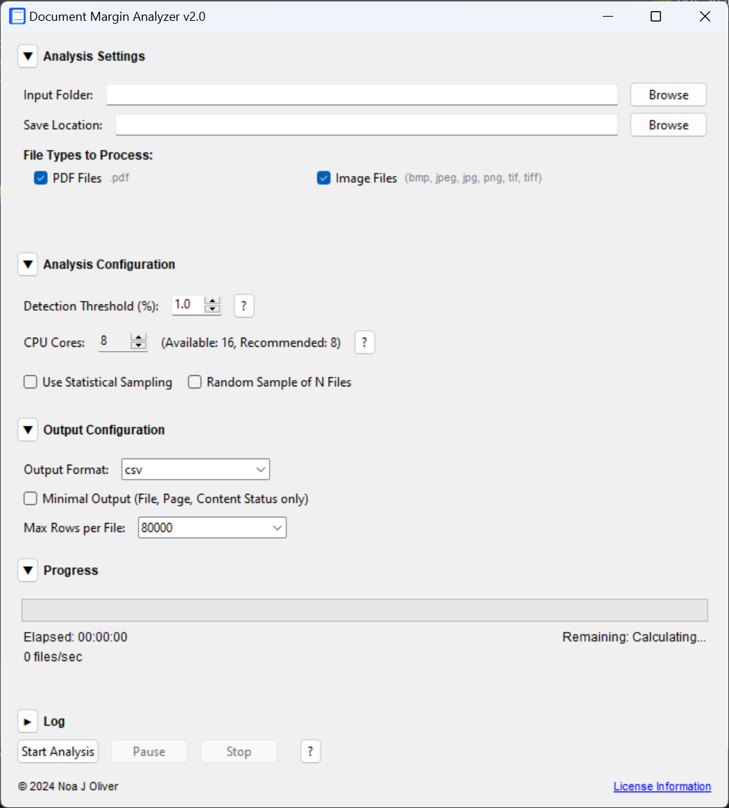

### Analysis Settings Section
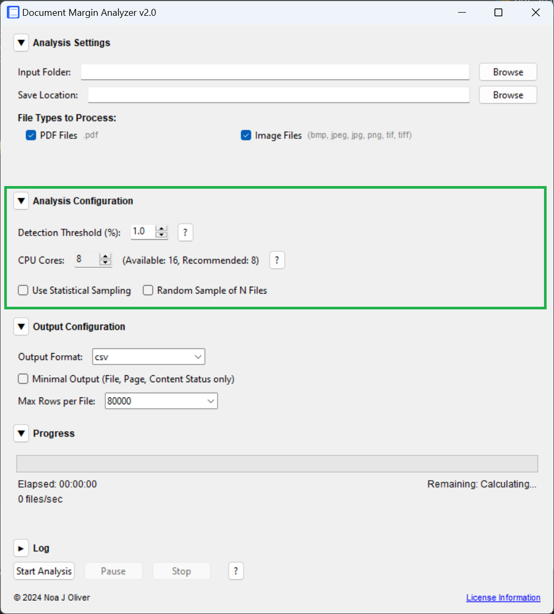

#### Input Selection
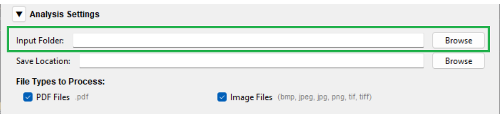

#### Save Location
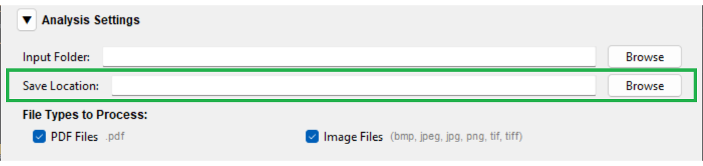

#### File Types
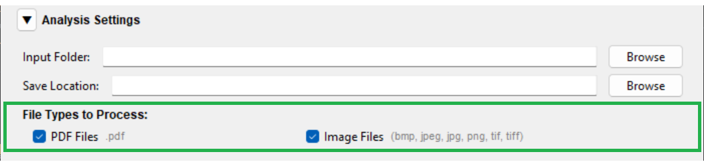

### Analysis Configuration
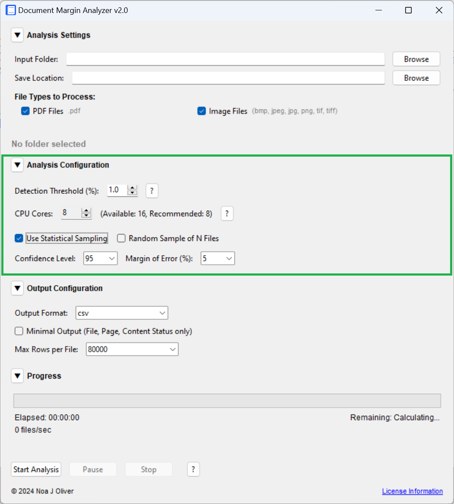

#### Detection Threshold
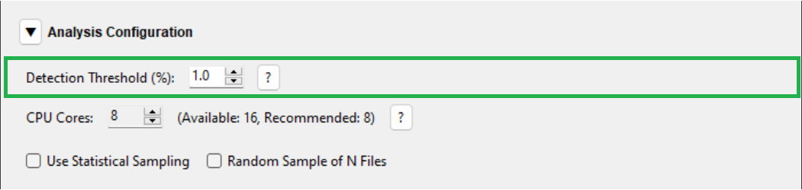

- 0.1-0.5%: Extremely sensitive, flags minimal content
- 1.0%: Standard detection level (recommended)
- 1.1-2.0%: Moderate tolerance
- 2.1-5.0%: Ignores minor marks
- 5.1-10.0%: Only flags substantial content

#### CPU Configuration
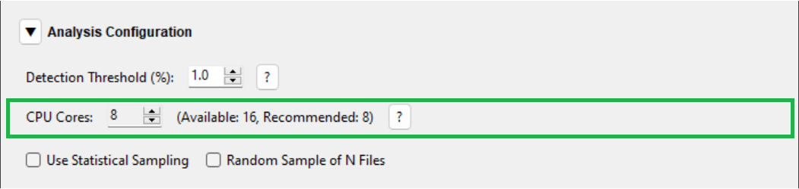

- Shows available cores
- Recommended settings
- Performance impact guide

#### Sampling Configuration
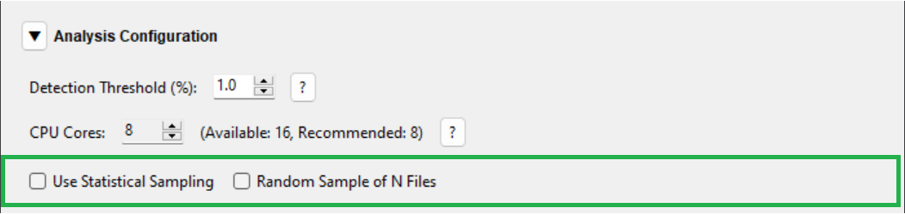

### Output Configuration
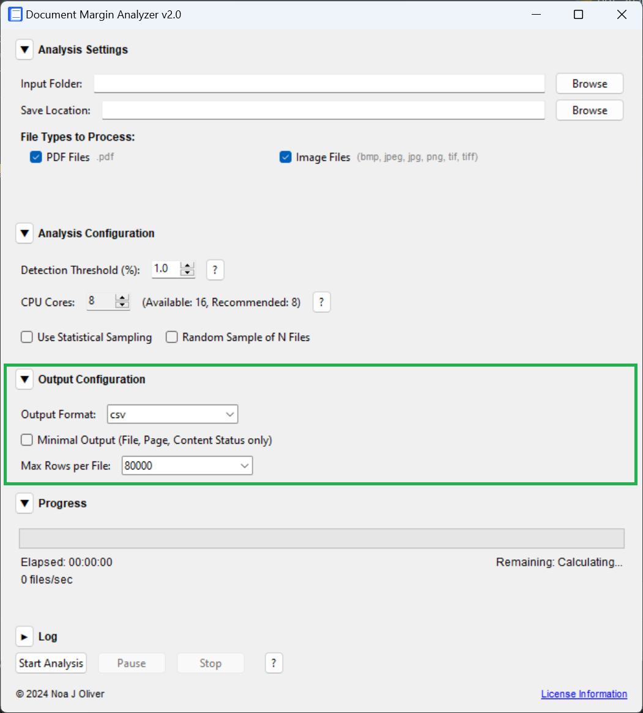

### Progress Monitoring
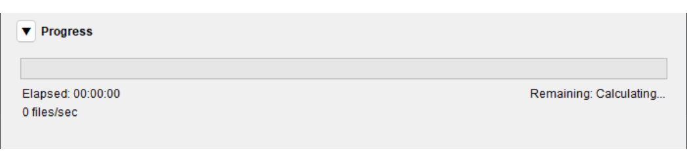

### Log View
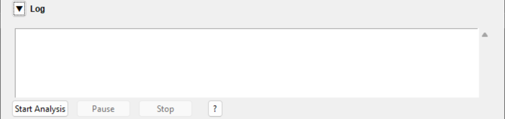

## Analysis Process

1. Configure Input/Output
   - Select input folder containing documents
   - Choose save location
   - Select file types to process (PDF/Images)

2. Configure Analysis Settings
   - Set detection threshold (0.1-10.0%)
   - Configure CPU cores
   - Enable sampling if needed
   - Select output format

3. Start Analysis
   - Click "Start Analysis"
   - Monitor progress
   - View log for details

4. Review Results
   - Check output files
   - Review processing report
   - Address any errors

## Troubleshooting

### Common Issues
1. File Access
   - Verify folder permissions
   - Check file availability
   - Ensure files aren't in use

2. Performance
   - Adjust CPU core usage
   - Enable sampling for large datasets
   - Check available disk space

3. Output Issues
   - Verify write permissions
   - Ensure sufficient disk space
   - Check file format compatibility

## About
© 2024 Noa J Oliver
This program is free software under the GNU General Public License v3.0.