# Document Margin Analyzer
## User Guide

## Table of Contents
1. [Getting Started](#getting-started)
2. [Interface Overview](#interface-overview)
3. [Configuration Options](#configuration-options)
4. [Analysis Process](#analysis-process)
5. [Output Formats](#output-formats)
6. [Troubleshooting](#troubleshooting)
7. [Advanced Features](#advanced-features)

## Getting Started

### System Requirements
- Windows 10 or later
- Minimum 4GB RAM (8GB recommended)
- Screen resolution: 1024x768 or higher
- Sufficient disk space for output files (varies by dataset size)

### What This Tool Does
Document Margin Analyzer examines PDF documents and images to detect content in header and footer margin areas. This is useful for:
- Document compliance checking
- Quality control workflows
- Automated document processing
- Identifying improperly formatted documents

## Interface Overview

### Main Application Window
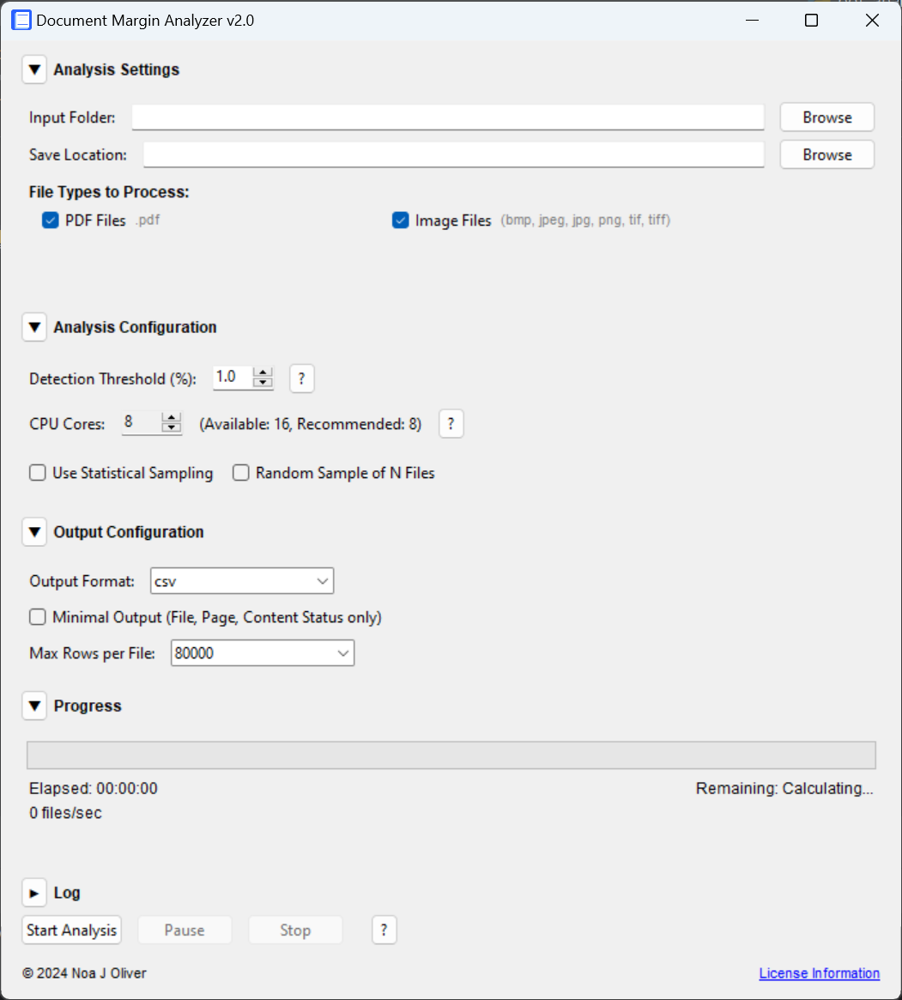

The main application window provides a comprehensive interface for document analysis with the following key areas:

- **Analysis Settings Panel** (Top): Configure all analysis parameters including thresholds, margins, and processing options
- **Input/Output Configuration** (Middle): Select source documents and destination for results
- **Progress Monitoring** (Bottom Left): Real-time progress bar and status updates during processing
- **Activity Log** (Bottom Right): Detailed log of all operations, errors, and processing information
- **Control Buttons**: Start Analysis, Pause/Resume, and Stop buttons for process control
- **Status Bar**: Quick access to User Guide link and application information

### Analysis Settings Section
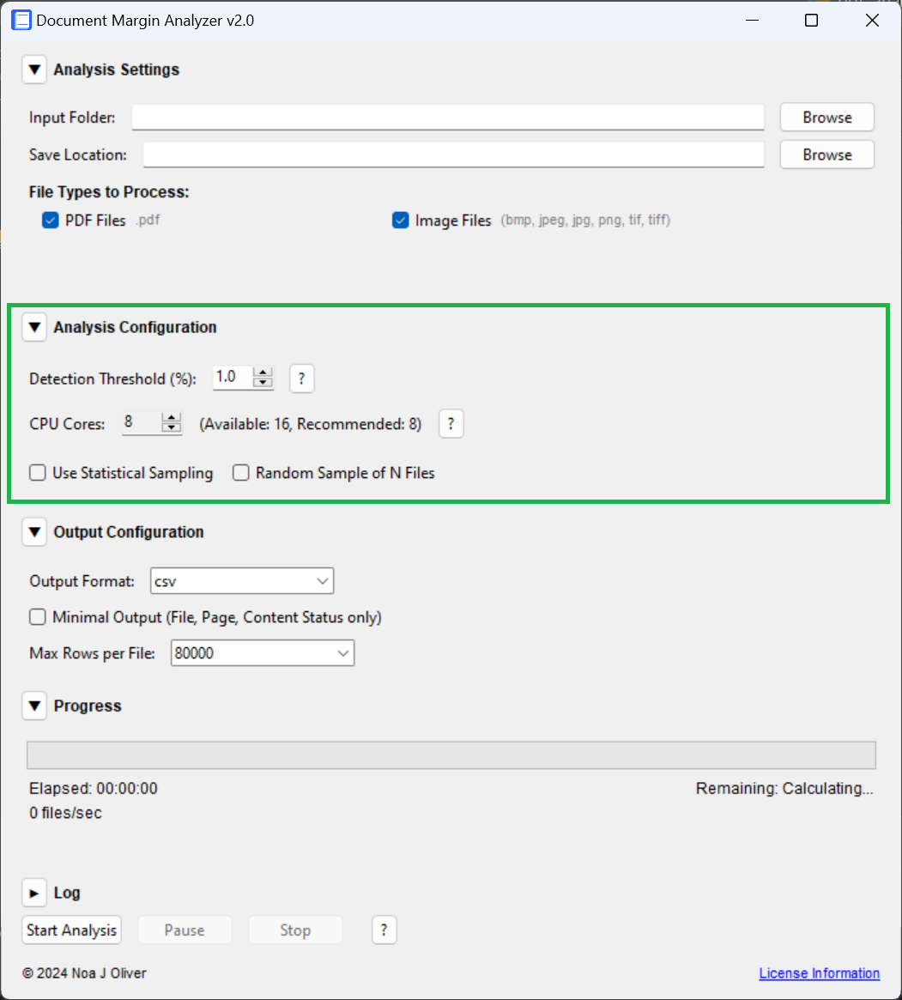

This section contains all the critical configuration options for your document analysis:

- **Detection Settings**: Configure how sensitive the analysis should be to content in margins
- **Processing Options**: Control CPU usage and sampling methods for optimal performance

#### Input Selection
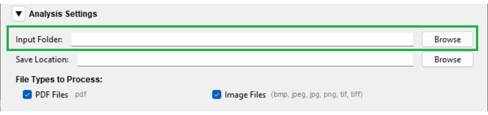

**How to select your input folder:**

1. **Click "Browse"** next to the Input Folder field
2. **Navigate** to the folder containing your documents
3. **Select the folder** and click "Select Folder"
4. The application will:
   - Scan the selected folder and all subfolders
   - Count compatible files (PDFs and/or images)
   - Display the file count below the input field
   - Example: "Found 1,234 files (789 PDFs, 445 images)"

**Important considerations:**
- The folder can contain mixed file types - the analyzer will process only selected types
- Subfolders are automatically included in the scan
- Network drives and cloud-synced folders (OneDrive, Google Drive) are supported
- System folders ($RECYCLE.BIN, System Volume Information) are automatically excluded
- Ensure you have read permissions for all files in the selected folder

#### Save Location
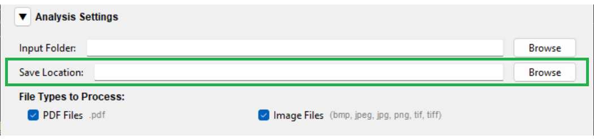

**Setting up your output location:**

1. **Click "Browse"** next to the Save Location field
2. **Choose or create** a folder for the analysis results
3. **Enter a filename** (without extension) or use the auto-generated name
4. The application will:
   - Automatically append the correct file extension (.csv, .parquet, or .db)
   - Add timestamps to prevent overwriting existing files
   - Create the output folder if it doesn't exist

**Output naming convention:**
- For CSV files exceeding row limits: `_part1`, `_part2`, etc. are appended

**Storage requirements:**
- CSV: Typically require 100-300 bytes per page analyzed, so analyzing 100,000 pages would need approximately 10-30 MB of disk space for the output file
- Parquet: 30-50% less space than CSV
- SQLite: Similar to Parquet with additional indexing overhead
- Ensure sufficient free disk space before starting analysis

#### File Types
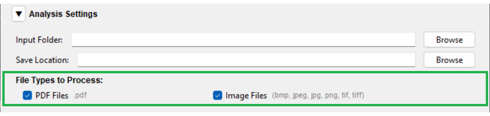

**Selecting file types to process:**

- **PDF Files** ☑️: 
  - Analyzes both text and image content within PDFs
  - Processes each page individually
  - Handles encrypted PDFs (reports as errors)
  - Supports all standard PDF versions
  
- **Image Files** ☑️: 
  - Supported formats: JPG, JPEG, PNG, BMP, and TIFF
  - Multi-page TIFF files are fully supported (each page analyzed separately)
  - Single-page images (JPG, PNG, BMP) treated as one page
  - Analyzes pixel content for marks in margin areas
  - Large images may require more processing time

**Tips:**
- Select both types for comprehensive analysis
- Deselect a type to skip those files entirely
- Processing time varies: PDFs with many pages take longer than single images
- The file count updates dynamically when you change selections

## Configuration Options

### Analysis Configuration
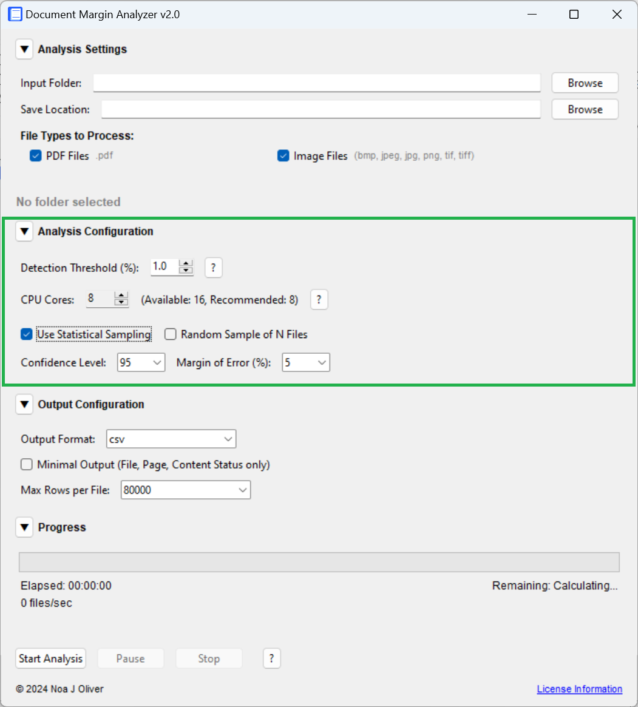

The Analysis Configuration panel is where you fine-tune how the document analyzer examines your files. This section controls the core detection parameters that determine what content is flagged.

#### Margin Configuration
**Defining your document margins:**

- **Top Margin (%)**: 
  - Range: 0-50% of page height
  - Default: 4.5%
  - Purpose: Defines how much of the top of each page is considered the "header zone"
  - Example: 5% on a standard 11" page = top 0.55 inches
  
- **Bottom Margin (%)**: 
  - Range: 0-50% of page height  
  - Default: 4.5%
  - Purpose: Defines how much of the bottom of each page is considered the "footer zone"
  - Example: 5% on a standard 11" page = bottom 0.55 inches

**How to set margins:**
1. Use the slider or type a value directly
2. Consider your document layout:
   - Standard documents: 4-6%
   - Documents with large headers/footers: 8-12%
   - Minimal margins: 2-3%

#### Detection Threshold
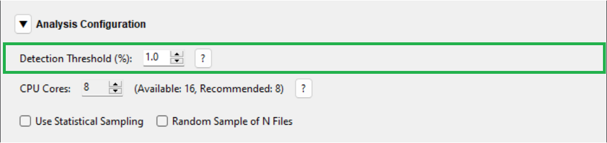

**Understanding the detection threshold:**

The threshold determines how much content must be present in a margin area before it's flagged. This is the most critical setting for accurate analysis.

- **Range**: 0.1% to 10.0% (adjustable in 0.1% increments)
- **Default**: 0.5% (recommended starting point)
- **What it means**: Percentage of the margin area that must contain marks/content

**Sensitivity Levels and Use Cases**:

- **0.1-0.4%** (Extremely Sensitive):
  - Detects: Tiny dots, stray marks, compression artifacts
  - Use for: Critical compliance checks, legal documents
  - Warning: May produce false positives from scanner dust or artifacts
  
- **0.5%** (Standard - Recommended):
  - Detects: Page numbers, small logos, watermarks
  - Use for: General document quality control
  - Best balance between sensitivity and accuracy
  
- **0.6-2.0%** (Moderate Tolerance):
  - Detects: Substantial text, clear graphics
  - Use for: Documents with known minor artifacts
  - Ignores most compression artifacts and tiny marks
  
- **2.1-5.0%** (Lower Sensitivity):
  - Detects: Large blocks of text, prominent graphics
  - Use for: Quick screening of major issues
  - Suitable for documents with acceptable small marks
  
- **5.1-10.0%** (Minimal Sensitivity):
  - Detects: Only very substantial content
  - Use for: Finding severe margin violations only
  - Will miss small page numbers and watermarks

**How to choose the right threshold:**
1. Start with 0.5% for initial analysis
2. Review a sample of results
3. If too many false positives: Increase threshold
4. If missing real content: Decrease threshold
5. Document your chosen threshold for consistency

#### CPU Configuration
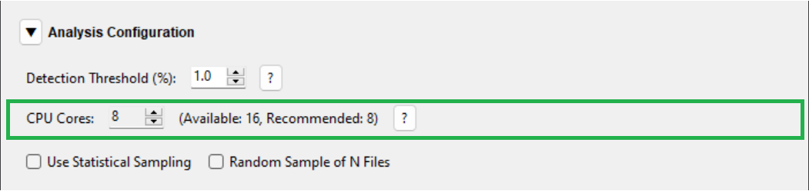

**Optimizing processing performance:**

The CPU configuration controls how many processor cores are used for parallel document processing. Proper configuration ensures fast analysis without freezing your system.

- **Available Cores**: Displays total CPU cores detected on your system
- **Default Setting**: One-half the number of system cores (e.g., 4 cores on an 8-core system)
- **Range**: 1 to maximum available cores

**How to configure CPU usage:**

1. **Check the dropdown** to see available options (e.g., "1 core" through "8 cores")
2. **Consider your needs**:
   - **Maximum Performance** (All cores):
     - Use when: System is dedicated to analysis
     - Benefit: Fastest possible processing
     - Warning: System may become unresponsive
   
   - **Balanced** (75% of cores - Recommended):
     - Use when: Need to use computer during analysis
     - Benefit: Good speed while maintaining system responsiveness
     - Example: 6 cores on an 8-core system
   
   - **Conservative** (50% of cores):
     - Use when: Running other intensive applications
     - Benefit: Ensures smooth multitasking
     - Trade-off: Longer processing time
   
   - **Minimal** (1-2 cores):
     - Use when: System resources are limited
     - Benefit: Maximum system availability
     - Best for: Background processing

**Performance expectations:**
- Each core processes files independently
- Linear scaling: 8 cores ≈ 8x faster than 1 core
- PDF processing benefits most from multiple cores
- Memory usage increases with more cores

### Sampling Configuration
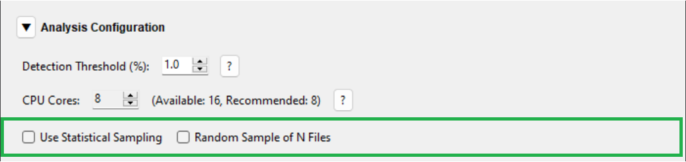

**When and how to use sampling:**

Sampling allows you to analyze a subset of documents instead of processing everything. This is essential for large document collections where full analysis would take too long or isn't necessary.

#### Statistical Sampling
**For scientifically valid sampling:**

- **Purpose**: Analyze a mathematically representative sample of your documents
- **How it works**: Calculates optimal sample size based on statistical principles

**Configuration options:**

1. **Confidence Level** (Dropdown):
   - **90%**: Basic confidence, smaller sample size
   - **95%**: Standard confidence (recommended)
   - **99%**: High confidence, larger sample size
   - Meaning: How sure you are that results represent the full dataset

2. **Margin of Error** (Dropdown):
   - **1%**: Very precise, requires large sample
   - **3%**: High precision
   - **5%**: Standard precision (recommended)
   - **10%**: Lower precision, smaller sample
   - Meaning: How much the sample results might differ from analyzing everything

**Example scenarios:**
- 10,000 documents with 95% confidence, 5% margin = ~370 file sample
- 100,000 documents with 95% confidence, 5% margin = ~383 file sample
- Note: Sample size plateaus for very large datasets

**Best for:**
- Compliance audits requiring statistical validity
- Quality control with defined confidence requirements
- Large datasets where patterns are more important than individual files

#### Random N Sampling
**For fixed-size sampling:**

- **Purpose**: Analyze exactly N randomly selected files
- **How it works**: Randomly selects the specified number of files

**Configuration options:**
- **Sample Size** (Dropdown): 10, 100, 500, 1000, 5000, or 10000 files
- **Selection**: Truly random across entire folder structure

**Use cases by sample size:**
- **10 files**: Quick spot check, settings verification
- **100 files**: Basic quality assessment
- **500 files**: Moderate confidence screening
- **1000 files**: Detailed analysis of large datasets
- **5000 files**: Comprehensive sampling
- **10000 files**: Near-complete coverage for most needs

**Best for:**
- Initial testing of analysis settings
- Time-boxed analysis (know exactly how many files)
- Periodic quality checks
- When statistical validity isn't required

**Important notes:**
- Only one sampling method can be active at a time
- Files are selected before processing begins
- Uncheck both options to analyze all files

### Output Configuration
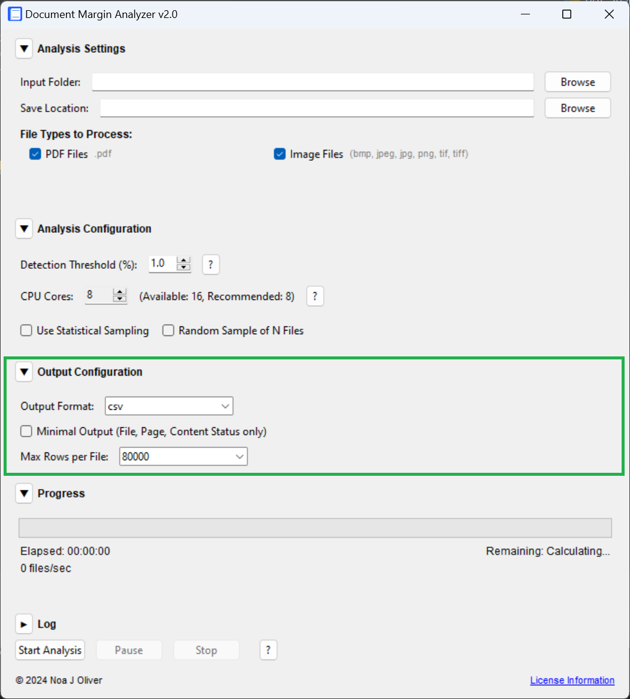

**Choosing the right output format and options:**

The output configuration determines how your analysis results are saved and structured. Choose based on how you plan to use the data.

#### Output Format Selection

**1. CSV (Comma-Separated Values)** 📊
- **Best for**: Excel users, simple reporting, sharing with others
- **Advantages**:
  - Opens directly in Excel/Google Sheets
  - Human-readable text format
  - Universal compatibility
  - Easy to filter and sort
- **Configuration**:
  - **Max Rows per File**: 10,000 / 50,000 / 80,000 / 100,000
  - Choose based on Excel version (older Excel: 65,536 rows limit)
  - Files automatically split when limit reached
  - Split files named: `_part1.csv`, `_part2.csv`, etc.
- **File size**: Largest format, approximately 100-300 bytes per row

**2. Parquet** 🗜️
- **Best for**: Data science, big data workflows, Python/R analysis
- **Advantages**:
  - 60-80% smaller than CSV
  - Preserves data types perfectly
  - Very fast to read/write
  - Columnar storage for efficient queries
- **Compatibility**:
  - Python: `pandas.read_parquet()`
  - R: `arrow::read_parquet()`
  - Apache Spark, Databricks, AWS Athena
- **File size**: Highly compressed, ~40-60 bytes per row

**3. SQLite Database** 🗃️
- **Best for**: Complex queries, relational analysis, applications
- **Advantages**:
  - Full SQL query capability
  - Indexed for fast searches
  - Single file contains everything
  - Can JOIN with other data
- **Note**: Minimal Output mode is disabled for SQLite
- **Usage examples**:
  ```sql
  SELECT * FROM analysis_results WHERE content_status LIKE '%header%';
  SELECT COUNT(*) FROM analysis_results GROUP BY file_type;
  ```
- **File size**: Similar to Parquet with index overhead

#### Minimal Output Mode
**Streamlined results for basic needs:**

☑️ **"Minimal Output (File, Page, Type, Content Status only)"**

- **When enabled**:
  - Only 4 columns in output
  - Faster processing and smaller files
  - Perfect for simple pass/fail reporting
  
- **What's included**:
  1. **File**: Full path to document
  2. **Page**: Page number
  3. **Type**: PDF or Image
  4. **Content Status**: Detection result
  
- **What's excluded**:
  - Detailed percentages
  - Text vs. image analysis breakdown
  - Error details
  - Margin configuration used
  
- **Best for**:
  - Quick compliance checks
  - Large-scale screening
  - When you only need to know which files have issues
  
- **Not available for**: SQLite format (requires full schema)

### Progress Monitoring
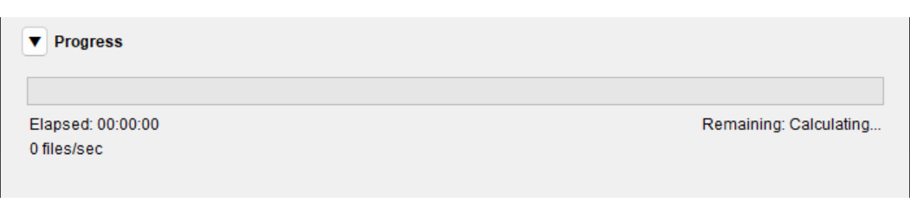

**Real-time analysis tracking:**

The progress section provides live feedback during document processing, helping you monitor the analysis and estimate completion time.

**Progress indicators:**

1. **Progress Bar**:
   - Visual representation of completion percentage
   - Green fill shows completed portion
   - Updates in real-time as files are processed

2. **Status Text**:
   - Shows current operation (e.g., "Processing PDFs...", "Writing results...")
   - Displays file counts: "Processed 1,234 of 5,678 files"
   - Updates every few files for performance

3. **Statistics Panel**:
   - **Files/sec**: Current processing speed
   - **Elapsed Time**: How long analysis has been running
   - **Estimated Time**: Predicted time to completion
   - **Success Rate**: Percentage of files processed without errors

4. **Control Buttons**:
   - **Pause**: Temporarily stops processing (can resume)
   - **Resume**: Continues paused analysis
   - **Stop**: Cancels analysis (cannot resume)

**Understanding progress patterns:**
- **Fast start**: Image files process quickly
- **Slower middle**: Multi-page PDFs take longer
- **Speed variations**: Normal due to file size differences
- **Final phase**: Writing results may show 100% briefly

**Performance indicators:**
- **Good**: 10-50 files/second for mixed content
- **Normal**: 5-10 files/second for complex PDFs
- **Slow**: <5 files/second (check CPU settings)

### Log View
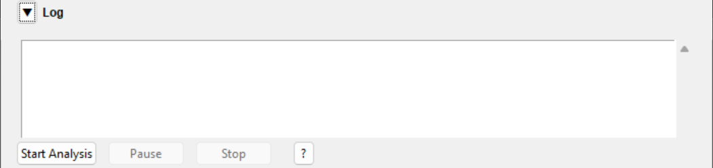

**Detailed operation tracking:**

The log section provides a comprehensive record of all operations, making it invaluable for troubleshooting and verification.

**Log entry types:**

1. **Information Messages** (Black text):
   - Normal operations: "Processing PDF 123/456..."
   - Configuration details: "Using 6 CPU cores"
   - Progress updates: "Batch complete"

2. **Success Messages** (Green text):
   - Successful operations: "Analysis complete"
   - Milestone achievements: "Output file created"

3. **Warning Messages** (Orange text):
   - Non-critical issues: "Skipping encrypted file"
   - Performance advisories: "Low memory detected"

4. **Error Messages** (Red text):
   - Processing failures: "Failed to open file"
   - Critical issues: "Insufficient disk space"

**Log features:**

- **Auto-scroll**: Follows latest entries automatically
- **Timestamps**: Each entry shows when it occurred
- **Copy capability**: Select and copy text for reports
- **Persistent**: Remains available after analysis completes
- **Detailed errors**: Full error messages and stack traces

**Using the log effectively:**

1. **During analysis**:
   - Monitor for repeated errors
   - Check processing speed
   - Verify correct files are being processed

2. **After completion**:
   - Review error summary
   - Check total files processed
   - Identify problem files
   - Copy important messages

3. **For troubleshooting**:
   - Look for error patterns
   - Check file paths for access issues
   - Verify configuration was applied
   - Save log content before closing

**Log messages to watch for:**
- "Using statistical sampling" - Confirms sampling is active
- "Writing results to" - Shows output location
- "Analysis complete" - Successful completion
- "Error summary" - Lists all problems encountered

## Recommended Workflow

### Overview
The Document Margin Analyzer is designed for an iterative workflow that ensures accurate results before processing large document sets. This approach saves time and computing resources while maximizing accuracy.

### Step 1: Initial Testing with Sample Set
**Start small to dial in your settings:**

1. **Utilize the Random Sample of N Files option** with 100 or 500 representative documents (depending on your dataset size)
   - Include various document types you'll be analyzing
   - Mix of good documents and known issues
   - Different sources (scanned, digital, faxed)

2. **Use default settings** for first run:
   - Threshold: 0.5% (standard sensitivity)
   - Margins: 4.5% top and bottom (≈0.5" on 8.5x11" paper)
   - All file types selected
   - No sampling (analyze all test files)
   - Full output mode (not minimal)

3. **Run initial analysis** and review results carefully

### Step 2: Visual Validation
**Compare results with actual documents:**

1. **Open flagged documents** in your PDF/image viewer
2. **Check each reported issue**:
   - Is the content actually in the margin?
   - Is it content you care about?
   - Are there false positives?

3. **Document patterns**:
   - Faxed documents may have edge artifacts
   - Scanned documents might have dust/specks
   - Digital PDFs typically have cleaner margins

### Step 3: Iterative Refinement
**Adjust settings based on findings:**

**If too many false positives (detecting irrelevant marks):**
- Increase threshold incrementally (0.5% → 0.8% → 1.2%)
- Faxed documents often need 1.0-2.0% threshold
- Poor quality scans may need 2.0-3.0%

**If missing real content:**
- Decrease threshold (0.5% → 0.3% → 0.2%)
- Check if margins are set correctly
- Verify page orientation is consistent

**For non-standard page sizes:**
- Adjust margin percentages
- Legal size (8.5x14"): Consider 3.5% margins
- A4 paper: Default 4.5% usually works
- Custom sizes: Calculate based on actual measurements

**Special considerations by document type:**
- **Faxed documents**: Often need 1.0-2.0% threshold due to transmission artifacts
- **Scanned documents**: May need 0.8-1.5% threshold for dust/specks
- **Digital PDFs**: Can use 0.3-0.5% for high sensitivity
- **Mixed sources**: Use threshold that works for lowest quality

### Step 4: Production Run Strategy
**Once settings are optimized:**

1. **For complete analysis** (smaller datasets <10,000 files):
   - Use your refined settings
   - Enable minimal output for pass/fail results
   - Review summary statistics first

2. **For large datasets** (>10,000 files):
   - Enable statistical sampling (95% confidence, 5% margin)
   - This typically analyzes 300-400 files regardless of total size
   - Provides scientifically valid results

3. **For ongoing monitoring**:
   - Use Random N sampling (500-1000 files)
   - Run periodically with same settings
   - Track trends over time

### Step 5: Results Interpretation
**Understanding your output:**

**During testing phase (full output):**
- Review all columns to understand detection patterns
- Pay attention to percentages - they indicate severity
- Use Error column to identify problem files

**During production (minimal output):**
- Focus on Content Status column
- "All content within margins" = Pass
- Any other status = Requires review
- Sort/filter by status for efficient review

### Practical Example Workflow

**Scenario**: Analyzing 50,000 archived documents (mix of scanned and faxed)

1. **Test Phase**:
   - Test 100 files using Random N sampling
   - Run with defaults (0.5% threshold, 4.5% margins)
   - Results show 40% false positives from fax artifacts

2. **Refinement**:
   - Increase threshold to 1.0% - still 20% false positives
   - Increase to 1.5% - 5% false positives, acceptable
   - Verify no real issues were missed

3. **Production**:
   - Configure: 1.5% threshold, statistical sampling
   - Enable minimal output
   - Run analysis - processes 385 files in 2 minutes
   - Results: 8% of documents have margin content

4. **Follow-up**:
   - Filter results for files with issues
   - Batch review flagged documents
   - Take corrective action as needed

### Tips for Success

1. **Document your settings**:
   - Record final threshold and margins used
   - Note document types and quality levels
   - Save for consistent future analyses

2. **Quality control**:
   - Periodically re-test with known documents
   - Adjust if document quality changes
   - Monitor false positive rates

3. **Performance optimization**:
   - Test settings thoroughly before large runs
   - Use sampling for initial assessment
   - Run full analysis only when necessary

4. **Common threshold guidelines**:
   - **0.1-0.4%**: Digital PDFs, critical compliance
   - **0.5-0.8%**: Standard mixed documents
   - **1.0-2.0%**: Faxed or lower quality scans
   - **2.0-5.0%**: Poor quality, artifact-heavy documents

Remember: Time spent optimizing settings on a small sample saves hours on large datasets and ensures accurate, actionable results.

## Analysis Process

1. Configure Input/Output
   - Select input folder containing documents
   - Choose save location
   - Select file types to process (PDF/Images)

2. Configure Analysis Settings
   - Set detection threshold (0.1-10.0%)
   - Configure CPU cores
   - Enable sampling if needed
   - Select output format

3. Start Analysis
   - Click "Start Analysis"
   - Monitor progress
   - View log for details

4. Review Results
   - Check output files
   - Review processing report
   - Address any errors

## Output Formats

### Output File Naming
- CSV with splitting: `document_analysis_part1.csv`, etc.
- Extensions: `.csv`, `.parquet`, `.db` (SQLite)

### Output Columns

#### Standard Output Columns
1. **File**: Absolute path to the analyzed document
2. **Page**: Page number (1-based, always 1 for images)
3. **Type**: File type (PDF or Image)
4. **Content Status**: Overall detection result
   - "All content within margins" - No content detected in margins
   - "Content found in header" - Content detected in top margin
   - "Content found in footer" - Content detected in bottom margin
   - "Content found in header and footer" - Content in both margins
   - "Processing Failed" - Error during analysis

#### Detailed Analysis Columns (Full Output Mode)
5. **Text Status**: Text detection status (PDF only)
6. **Image Status**: Image/graphic content detection status
7. **text_top_content_percentage**: Percentage of top margin with text (PDF only)
8. **text_bottom_content_percentage**: Percentage of bottom margin with text (PDF only)
9. **image_top_content_percentage**: Percentage of top margin with image content
10. **image_bottom_content_percentage**: Percentage of bottom margin with image content
11. **total_margin_content_percentage**: Combined margin content percentage (images only)
12. **margins_used_top_margin_percentage**: Top margin setting used for analysis
13. **margins_used_bottom_margin_percentage**: Bottom margin setting used for analysis
14. **Error**: Error details if processing failed
15. **Error Severity**: Severity level (WARNING, ERROR)

### Working with Output Files

#### CSV Files
- Open directly in Excel or any spreadsheet application
- Use text import wizard for large files
- Files are automatically split when row limit is reached

#### Parquet Files
- Use Python with pandas: `pd.read_parquet('file.parquet')`
- Compatible with Apache Spark, R, and other data tools
- Can be viewed using VS Code with Parquet extension (display as JSON)
- Compressed format saves disk space

#### SQLite Database
- Use any SQLite browser or client
- Can be viewed using VS Code with SQLite extension or using DBeaver or DBVisualizer
- Query with SQL: `SELECT * FROM results WHERE content_status != 'All content within margins'`
- Table name: `analysis_results`

## Troubleshooting

### Common Issues and Solutions

#### 1. Input/Output Errors
- **"Please select an input folder!"** - Click Browse to select a folder containing documents
- **"Please select a save location!"** - Choose where to save the analysis results
- **"Selected folder does not exist!"** - Verify the folder path is correct and accessible
- **"Please select at least one file type to process!"** - Enable either PDF or Image processing

#### 2. Configuration Errors
- **"Threshold must be between 0.1% and 10.0%"** - Adjust the detection threshold within valid range
- **"Please select only one sampling method!"** - Choose either Statistical or Random N sampling, not both
- **"Invalid sampling parameters!"** - Check confidence level and margin of error values

#### 3. Processing Errors
- **PDF Processing Failed**: 
  - Ensure PDF is not corrupted
  - Check if PDF is password-protected
  - Verify sufficient memory available
- **Image Processing Failed**:
  - Confirm image format is supported (JPG, PNG, BMP, TIFF)
  - Check if image file is corrupted
  - Ensure image is not too large for memory

#### 4. Performance Issues
- **Slow Processing**:
  - Reduce number of CPU cores if system becomes unresponsive
  - Enable sampling for very large datasets
  - Close other memory-intensive applications
  - Check available disk space 
- **Memory Errors**:
  - Process fewer files at once using sampling

#### 5. Output File Issues
- **Cannot Write Output**:
  - Ensure save location has write permissions
  - Check available disk space
  - Close output file if open in another program
- **CSV File Too Large for Excel**:
  - Reduce max rows per file setting
  - Use Parquet format for large datasets
  - Open in specialized data tools - notepad++ with the CsvQuery plugin works well for large CSV files

### Error Messages in Output

The application includes detailed error tracking:
- **Error Column**: Contains specific error details
- **Error Severity**: WARNING (minor issues) or ERROR (processing failures)
- **Content Status**: Will show "Processing Failed" for files with errors

### Getting Help

1. **Check the Log**: The log section shows detailed processing information
2. **Review Error Summary**: After analysis, check the error summary for patterns
3. **User Guide Link**: Click the User Guide link in the status bar
4. **GitHub Issues**: Report bugs at the project repository

## Advanced Features

### Multi-threaded Processing
- The application uses parallel processing for improved performance
- Each CPU core processes files independently
- Progress is updated in real-time

### Batch Processing
- Files are processed in batches for memory efficiency
- Default batch size: 1000 files
- Batch processing helps manage memory usage

### Error Recovery
- Processing continues even if individual files fail
- Failed files are logged and included in output
- Comprehensive error reporting for troubleshooting

### Status Bar Features
- **User Guide Link**: Click to open this guide in your browser
- **License Link**: View GPL v3.0 license details

### Keyboard Shortcuts
- Currently, the application uses standard Windows shortcuts:
  - Ctrl+C: Copy selected text from log
  - Ctrl+A: Select all text in input fields
  - Tab: Navigate between controls
  - Enter: Activate focused button

### Tips for Best Results

1. **Optimal Settings**:
   - Use 0.5% threshold for standard documents
   - Set margins to match your document layout (typically 5-10%)
   - Use all available CPU cores minus one

2. **Large Datasets**:
   - Enable statistical sampling with 95% confidence
   - Use Parquet output format
   - Process in multiple batches if needed

3. **Quality Assurance**:
   - Start with a small sample to verify settings
   - Review the log for any warnings
   - Check a few results manually to confirm accuracy

## AWS S3 Support

### Overview
The Document Margin Analyzer supports processing files directly from Amazon S3 buckets and uploading results back to S3. This enables cloud-based workflows without downloading large datasets locally.

### S3 Prerequisites
1. **AWS Account**: You need an active AWS account
2. **AWS Credentials**: Configure using one of these methods:
   - AWS CLI: `aws configure`
   - Environment variables: `AWS_ACCESS_KEY_ID` and `AWS_SECRET_ACCESS_KEY`
   - IAM roles (for EC2 instances)
3. **Permissions**: Your AWS credentials need:
   - `s3:ListBucket` for browsing buckets
   - `s3:GetObject` for downloading files
   - `s3:PutObject` for uploading results

### Configuring S3 Access
1. Click the **"S3 Config"** button in the main window
2. In the configuration dialog:
   - **AWS Profile**: Select your AWS profile (or use 'default')
   - **AWS Region**: Choose your preferred region
   - **Max Concurrent Downloads**: Set parallel download limit (1-20)
3. Click **"Test Connection"** to verify credentials
4. Click **"OK"** to save configuration

### Using S3 for Input Files
1. Select **"S3 Bucket"** radio button under Input Source
2. Click **"Browse"** to open the S3 browser
3. Navigate through your buckets and folders:
   - Select a bucket from the dropdown
   - Double-click folders to navigate
   - Click **"Select Folder"** when ready
4. The S3 path will appear as: `s3://bucket-name/folder/path/`

### Using S3 for Output Files
1. Select **"S3 Bucket"** radio button under Output Destination
2. Click **"Browse"** to select S3 location
3. Choose the destination folder
4. Enter a filename when prompted
5. The S3 path will appear as: `s3://bucket-name/folder/output.csv`

### S3 Processing Workflow
1. **File Discovery**: Lists all matching files in the S3 path
2. **Sampling**: Applies sampling rules (if enabled) to S3 file list
3. **Batch Download**: Downloads files in batches for processing
4. **Local Processing**: Analyzes files using temporary local cache
5. **Result Upload**: Automatically uploads results to S3 when complete
6. **Cleanup**: Removes temporary files after processing

### S3 Performance Tips
- **Batch Size**: Files are downloaded in batches to optimize performance
- **Parallel Downloads**: Adjust max concurrent downloads based on bandwidth
- **Large Datasets**: Use sampling for initial testing before full runs
- **Network**: Ensure stable internet connection for S3 operations

### S3 Limitations
- **Authentication**: Only supports standard AWS credential methods
- **Streaming**: Files must be downloaded before processing (no streaming)
- **Costs**: Standard AWS S3 charges apply for data transfer and storage

### Troubleshooting S3 Issues
1. **"S3 not configured"**: Click S3 Config and set up credentials
2. **"No credentials found"**: Ensure AWS credentials are properly configured
3. **"Access Denied"**: Check S3 bucket permissions for your AWS user
4. **"Connection timeout"**: Verify internet connection and AWS region
5. **"Invalid S3 path"**: Use format `s3://bucket-name/folder/`

## About
© 2024 Noa J Oliver
This program is free software under the GNU General Public License v3.0.
For updates and support, visit the project repository.